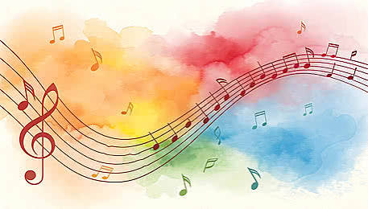

# Alexvortex
Alalalalal
<!DOCTYPE html>
<html>
<head>
   <meta charset="UTF-8">
   <title>Rincón Musical</title>
</head>
<body bgcolor="#7A0016">
   
      
      

         <h1>🎵 BIENVENIDOS A MI PÁGINA DE MÚSICA 🎶</h1>
      

      
       
      
      

         <h3>
            <a style="text-decoration:none;" href="https://www.zeitverschiebung.net/es/country/sv">
               Hora local para escuchar música en 
               El Salvador
            </a>
         </h3> 
         <iframe src="https://www.zeitverschiebung.net/clock-widget-iframe-v2?language=es&size=medium&timezone=America%2fEl_Salvador" width="100%" height="115" frameborder="0" seamless></iframe> 
      

      

         
La música es el arte de organizar de manera sensible y lógica una combinación coherente de sonidos y silencios, utilizando los principios fundamentales de la melodía, la armonía y el ritmo.

         
Más allá de su definición técnica, la música es una forma de expresión cultural y emocional universal: es el lenguaje con el que transmitimos ideas, estados de ánimo, historias y sensaciones que a menudo las palabras no pueden capturar por sí solas.

         
          
         
           

         <h3>Los tres elementos clave de la música</h3>
         
Para entender cómo se construye la música, podemos dividirla en sus tres pilares básicos:

         
<b>Melodía:</b> Es la sucesión horizontal de sonidos (notas) que percibimos como una sola frase o idea principal. Es la parte que normalmente tarareas o recuerdas de una canción.

         
<b>Armonía:</b> Es la combinación simultánea de dos o más sonidos (vertical). La armonía crea el trasfondo, los acordes y el ambiente sobre el cual camina la melodía.

         
<b>Ritmo:</b> Es la distribución del tiempo en la música. Dicta la duración de los sonidos, la velocidad del pulso y el patrón sobre el cual tu cuerpo siente ganas de moverse o bailar.

         
          
         
           

         <h3>¿Por qué nos conecta tanto?</h3>
         
La música estimula múltiples áreas del cerebro simultáneamente (el centro del lenguaje, la memoria, las emociones y el movimiento). Por eso puede hacer que recordemos un momento exacto del pasado, cambiar nuestro estado de ánimo en segundos o unir a miles de personas en un concierto.

         
          
         <video width="500" height="300" controls>
            <source src="Relief.mp4" type="video/mp4">
            Tu navegador no soporta el reproductor de video.
         </video>
           

         
Usa esta barra para buscar tus canciones favoritas:

         
         <!-- Búsqueda Musical en Google-->
         <form method="GET" action="https://www.google.com/search">
            <table bgcolor="#FFFFFF" style="color:black;">
               <tr>
                  <td>
                     
                     <input type="text" name="q" size="25" placeholder="Ej. Rock, Jazz, Bad Bunny...">
                     <input type="submit" name="btnG" value="Buscar Música">
                  </td>
               </tr>
            </table>
         </form>
      
   
      </body></html>
      
 
      <a href=https://open.spotify.com/intl-es target="_blank">Spotify</a>
       
